# 理解计算机系统



### [调试工具`GDB`][1]

编译时添加 `-g` 参数

``` bash
    $ gcc -g -o talk talkback.c
```

使用 gdb 指令执行程序

``` bash
    $ gdb talk
```

调试过程中出现以下提示：
> Missing separate debuginfos, use: debuginfo-install glibc-2.17-222.el7.x86_64

在使用 `debuginfo-install` 安装的时候要先检查 `/etc/yum.repos.d/CentOS-Debuginfo.repo`中的 `enable` 选项是否否为 `1`

## 相关链接

[GNU make](https://www.gnu.org/software/make/manual/html_node/index.html#Top)
[The GNU C Library](https://www.gnu.org/software/libc/manual/)


[1]: https://sourceware.org/gdb/current/onlinedocs/gdb/